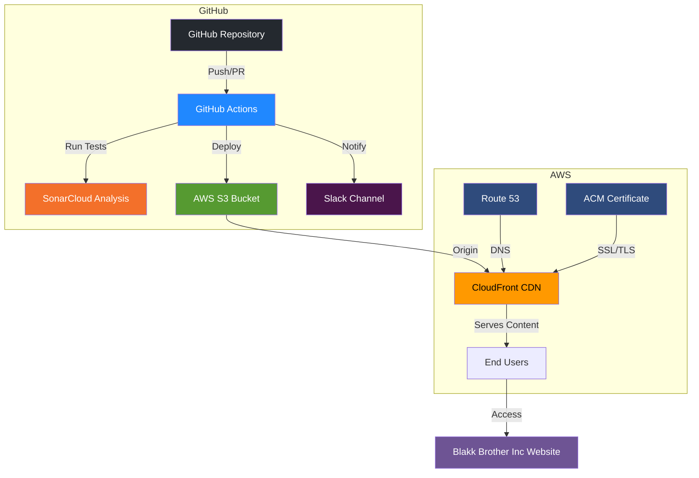

# Blakk Brother Inc - Cloud & DevOps Solutions

[](https://github.com/matthewntsiful/blakkbrotherinc-static-site-cicd-s3-cloudfront/actions/workflows/main.yml)
[](https://developer.mozilla.org/en-US/docs/Web/HTML)
[](https://developer.mozilla.org/en-US/docs/Web/CSS)
[](https://aws.amazon.com/s3/)
[](https://aws.amazon.com/cloudfront/)
[](https://github.com/features/actions)
[](https://sonarcloud.io/)
[](https://github.com/dependabot)
[](https://slack.com/)
[](https://opensource.org/licenses/MIT)

A modern, responsive static website showcasing Blakk Brother Inc's cloud and DevOps expertise, deployed using a fully automated CI/CD pipeline with AWS S3, CloudFront, and GitHub Actions.

## 🚀 Live Demo

**Primary Website (CloudFront CDN):** https://d2unm2fobk03v2.cloudfront.net/

**Alternative (S3 Static Hosting):** http://blakkbrotherinc-21-06-25.s3-website.eu-north-1.amazonaws.com/

> ⚡️ **Recommended:** Use the CloudFront URL for optimal performance, security (HTTPS), and global CDN benefits. The S3 URL is provided as a fallback option.

## 📋 Table of Contents

- [Features](#-features)
- [Tech Stack](#-tech-stack)
- [Architecture](#-architecture)
- [Getting Started](#-getting-started)
- [Deployment](#-deployment)
- [CI/CD Pipeline](#-cicd-pipeline)
- [Project Structure](#-project-structure)
- [Configuration](#-configuration)
- [Contributing](#-contributing)
- [License](#-license)

## ✨ Features

- **Responsive Design**: Mobile-first approach with modern CSS
- **Dark Theme**: Professional dark theme with cyan accents
- **Cloud/DevOps Focus**: Showcases cloud infrastructure and DevOps services
- **Automated Deployment**: Zero-downtime deployments with GitHub Actions
- **Code Quality**: Integrated SonarCloud analysis
- **CDN Distribution**: Global content delivery via CloudFront
- **Slack Notifications**: Real-time deployment status updates
- **Security**: Origin Access Control (OAC) for secure S3 access

## 🛠 Tech Stack

### Frontend
- **HTML5**: Semantic markup
- **CSS3**: Modern styling with flexbox/grid
- **Responsive Design**: Mobile-first approach

### Infrastructure
- **AWS S3**: Static website hosting
- **AWS CloudFront**: Global CDN distribution
- **AWS IAM**: Secure access management

### DevOps & CI/CD
- **GitHub Actions**: Automated workflows
- **SonarCloud**: Code quality analysis
- **Slack Integration**: Deployment notifications
- **AWS CLI**: Infrastructure automation
- **Dependabot**: Automated dependency updates

## 🏗 Architecture

### Infrastructure Overview



### Component Details

```
┌─────────────────┐    ┌──────────────────┐    ┌─────────────────┐
│   GitHub Repo   │───▶│  GitHub Actions  │───▶│   AWS S3 Bucket │
│                 │    │                  │    │                 │
│ • Source Code   │    │ • SonarQube      │    │ • Static Files  │
│ • Workflows     │    │ • Deploy         │    │ • Website Host  │
│ • Secrets       │    │ • Notifications  │    │                 │
└─────────────────┘    └──────────────────┘    └─────────────────┘
                                                         │
                                                         ▼
┌─────────────────┐    ┌──────────────────┐    ┌─────────────────┐
│     Users       │◀───│   CloudFront     │◀───│   Origin Access │
│                 │    │                  │    │    Control      │
│ • Global Access │    │ • CDN            │    │                 │
│ • Fast Loading  │    │ • HTTPS          │    │ • Secure Access │
│ • Cached Content│    │ • Custom Domain  │    │ • S3 Protection │
└─────────────────┘    └──────────────────┘    └─────────────────┘
```

## 🚀 Getting Started

### Prerequisites

- AWS Account with appropriate permissions
- GitHub repository
- SonarCloud account (free for public repos)
- Slack workspace (optional)

### Local Development

1. **Clone the repository**
   ```bash
   git clone https://github.com/YOUR-USERNAME/blakkbrotherinc-static-site-cicd-s3-cloudfront.git
   cd blakkbrotherinc-static-site-cicd-s3-cloudfront
   ```

2. **Open locally**
   ```bash
   # Simple HTTP server
   python -m http.server 8000
   # Or use Live Server extension in VS Code
   ```

3. **View in browser**
   ```
   http://localhost:8000
   ```

## 🚀 Deployment

### AWS Infrastructure Setup

1. **Create S3 Bucket**
   - Unique bucket name
   - Enable static website hosting
   - Configure bucket policy for CloudFront access

2. **Create CloudFront Distribution**
   - Origin: Your S3 bucket
   - Origin Access Control (OAC)
   - Default root object: `index.html`

3. **Create IAM User**
   - Policies: `AmazonS3FullAccess`, `CloudFrontFullAccess`
   - Generate access keys

### GitHub Secrets Configuration

Add these secrets to your GitHub repository:

```
AWS_ACCESS_KEY_ID=your_access_key
AWS_SECRET_ACCESS_KEY=your_secret_key
AWS_REGION=us-east-1
S3_BUCKET_NAME=your-bucket-name
CLOUDFRONT_DISTRIBUTION_ID=E1234567890ABC
SONAR_TOKEN=your_sonarcloud_token
SLACK_WEBHOOK_URL=your_slack_webhook_url
```

## 🔄 CI/CD Pipeline

The automated pipeline includes:

### 1. Code Quality Analysis
- **SonarCloud**: Security, maintainability, and reliability checks
- **Quality Gate**: Deployment blocked if quality standards not met

### 2. Deployment Process
- **S3 Sync**: Upload files with exclusions for non-web assets
- **CloudFront Invalidation**: Clear cache for immediate updates
- **Conditional Execution**: Only runs after successful quality checks

### 3. Notifications
- **Slack Integration**: Color-coded status updates
  - 🟢 Green: Successful deployment
  - 🔴 Red: Failed deployment
  - 🟡 Yellow: Cancelled deployment

### Workflow Triggers
- **Push to main**: Automatic deployment
- **Pull Requests**: Quality analysis only
- **Manual Dispatch**: On-demand deployment
- **Path-based**: Only triggers on relevant file changes

## 📁 Project Structure

```
.
├── .github/
│   ├── dependabot.yml        # Dependabot configuration
│   └── workflows/
│       ├── main.yml          # Main CI/CD pipeline
│       └── slack.yml         # Reusable Slack notifications
├── assets/
│   └── img/
│       ├── background.jpg    # Hero background image
│       └── logo.png          # Company logo
├── index.html                # Main HTML file
├── style.css                 # Stylesheet
├── sonar-project.properties  # SonarQube configuration
├── README.md                 # Project documentation
└── LICENSE                   # MIT License
```

## ⚙️ Configuration

### SonarQube Settings

```properties
# sonar-project.properties
sonar.projectKey=blakkbrotherinc-static-site
sonar.projectName=Blakk Brother Inc Static Site
sonar.sources=.
sonar.exclusions=.github/**,assets/**,*.md,LICENSE
sonar.web.fileExtensions=.html,.css,.js
```

### Workflow Configuration

- **Trigger Paths**: Only HTML, CSS, and assets
- **Quality Gates**: SonarCloud analysis required
- **Deployment Strategy**: Blue-green via CloudFront invalidation
- **Notification Strategy**: Status-based Slack alerts

## 🤝 Contributing

1. Fork the repository
2. Create a feature branch (`git checkout -b feature/amazing-feature`)
3. Commit your changes (`git commit -m 'Add amazing feature'`)
4. Push to the branch (`git push origin feature/amazing-feature`)
5. Open a Pull Request

### Development Guidelines

- Follow semantic HTML structure
- Maintain responsive design principles
- Ensure accessibility compliance
- Test across different browsers
- Update documentation as needed

## 📊 Monitoring & Analytics

- **CloudFront Metrics**: Available in AWS CloudWatch
- **SonarCloud Dashboard**: Code quality trends
- **GitHub Actions**: Deployment history and logs
- **Slack Notifications**: Real-time status updates

## 🔒 Security

- **Origin Access Control**: Prevents direct S3 access
- **HTTPS Enforcement**: All traffic encrypted via CloudFront
- **IAM Least Privilege**: Minimal required permissions
- **Secret Management**: Sensitive data in GitHub Secrets
- **Code Scanning**: Automated security analysis via SonarCloud
- **Dependency Updates**: Automated security patches via Dependabot

## 📈 Performance

- **Global CDN**: CloudFront edge locations worldwide
- **Optimized Assets**: Compressed images and minified CSS
- **Caching Strategy**: Efficient cache invalidation
- **Responsive Images**: Optimized for different screen sizes

## 🐛 Troubleshooting

### Common Issues

**CloudFront Access Denied**
- Verify Origin Access Control configuration
- Check S3 bucket policy
- Ensure distribution is deployed

**Deployment Failures**
- Check GitHub Secrets configuration
- Verify AWS permissions
- Review workflow logs

**SonarCloud Issues**
- Confirm project key matches configuration
- Verify SONAR_TOKEN is valid
- Check quality gate settings

## 📄 License

This project is licensed under the MIT License - see the [LICENSE](LICENSE) file for details.

## 🙏 Acknowledgments

- AWS for robust cloud infrastructure
- SonarCloud for code quality analysis
- GitHub Actions for seamless CI/CD
- The open-source community for inspiration

---

**Built by Blakk Brother Inc**

*Crafting Excellence, Building Legacy*